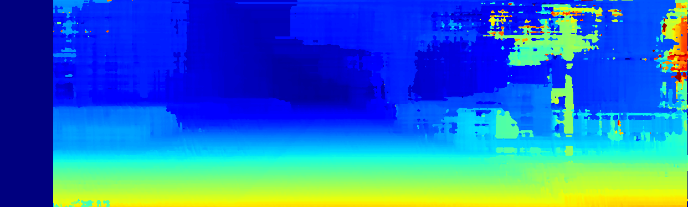
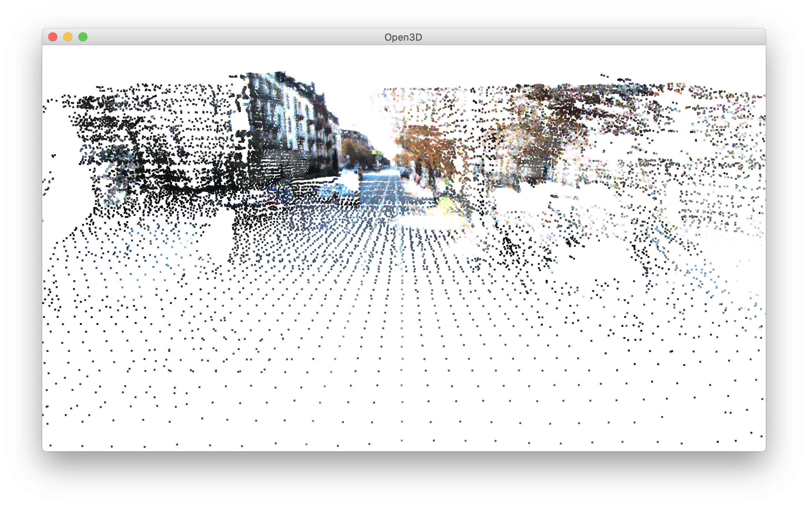
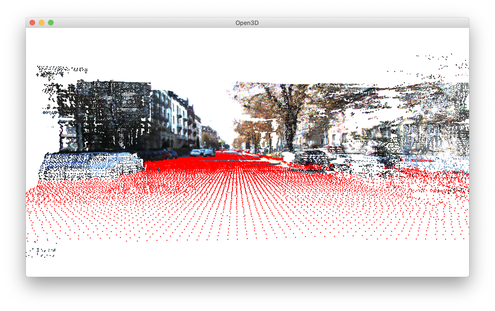

> Computer Vision Project
>
>Ioan Suflet - DSWT 1B
# Ground Detection from Stereo Images

This project aims to detect the ground plane using only 2 stereo images.


In order to get to the result there are several intermediate steps to follow. At first, a disparity map has been computed with StereoSGBM, then based on that a point cloud was generated with preserved color properties. Finally, using Plane Segmentation from [open3D](http://www.open3d.org) the plane with the largest support in the point cloud has been segmented. 

**Main steps:** 
- disparity map
  - post process 
- point cloud
  - generate
  - downsampling
  - remove outliers
- plane segmentation

## Prerequisites

This project needs the following libraries:
- [OpenCV](https://pypi.org/project/opencv-python/) 4.2.0.34 recommended
- Since [Open3D](https://pypi.org/project/open3d/) versions are substantially different, 9.0 was considered to be the best fit 
- [Progress](https://pypi.org/project/progress/) for terminal progress bar visualization, therefore is optional
- [MatPlotLib](https://pypi.org/project/matplotlib/) was used only for visual purpose. It is optional

As for the input images:
- [KITTI Stereo Evaluation 2015](http://www.cvlibs.net/datasets/kitti/eval_scene_flow.php?benchmark=stereo)
## Usage
### 1. Disparity Map
At first left and right images have to be loaded from the data set. In my case I used the KITTI data set.

Left image | Right image
------------ | -------------
 | 

Then, a Gaussian Blur filter was applied to eliminate possible noise followed by StereoSGBM function that returns a disparity map. 
```python
smooth_left = cv2.GaussianBlur(left, (kernel_size, kernel_size), 1.5)
smooth_right = cv2.GaussianBlur(right, (kernel_size, kernel_size), 1.5)

window_size = 9
left_matcher = cv2.StereoSGBM_create(
    numDisparities=96,
    blockSize=3,
    P1=8 * 3 * window_size ** 2,
    P2=32 * 3 * window_size ** 2,
    disp12MaxDiff=1,
    uniquenessRatio=16,
    speckleRange=2,
    mode=cv2.STEREO_SGBM_MODE_SGBM_3WAY
)
disparity_left = np.int16(left_matcher.compute(smooth_left, smooth_right))
```

### 2. Point cloud
#### 2.1 Generate
Now that we obtained the disparity map, we used it to compute the 3D point cloud. 
```cam1 = calib_matrix_1[:, :3]  # left image - P2
    cam2 = calib_matrix_2[:, :3]  # right image - P3

    Tmat = np.array([0.54, 0., 0.])

    rev_proj_matrix = np.zeros((4, 4))

    cv2.stereoRectify(cameraMatrix1=cam1, cameraMatrix2=cam2,
                      distCoeffs1=0, distCoeffs2=0,
                      imageSize=left.shape[:2],
                      R=np.identity(3), T=Tmat,
                      R1=None, R2=None,
                      P1=None, P2=None, Q=rev_proj_matrix)
``` 
Project the disparity map to the point cloud
```
points = cv2.reprojectImageTo3D(img, rev_proj_matrix)
```

#### 2.2 Downsampling
At this point we are working with maybe hundreds of files containing millions of voxels (a value on a regular grid in three-dimensional space). Since the used machine had a 2.9 GHz Dual-Core Intel Core i5, I needed to work with fewer values for a faster run.
1. Points are bucketed into voxels.
2. Each occupied voxel generates exact one point by averaging all points inside.
```
rez = geometry.PointCloud.voxel_down_sample(cloud, voxel_size=0.01)
``` 

#### 2.3 Removing outliers
When we reconstruct the point cloud, because the disparity map or even before that, the stereo input might have had noise, we encounter voxels out of place. In order to remove the noise there are two methods:
1. **Statistical outlier removal** removes points that are further away from their neighbors compared to the average for the point cloud
2. **Radius outlier removal** removes points that have few neighbors in a given sphere around them
```
rez, ind = geometry.PointCloud.remove_radius_outlier(cloud, nb_points=5, radius=0.08)
```

### 3. Plane Segmentation
Open3D library has support to segment geometric primitives using RANSAC. Thus, it finds the largest support in the point cloud that resembles a plane. This is perfect for our situations where the most spread surface is either the sky, or the ground.
```
plane_model, inliers = geometry.PointCloud.segment_plane(pcd_no_outliers, distance_threshold=0.01,
                                                                     ransac_n=3,
                                                                     num_iterations=2000)
```

## Acknowledgement
The basis of this project was inspired from:
- **Umang Shah**, [Stereo Vision for 3D Reconstruction](), retrieved on May 2020
- [Open3D: A Modern Library for 3D Data Processing](http://www.open3d.org/docs/latest)
- [OpenCV-Python Tutorials](https://opencv-python-tutroals.readthedocs.io/en/latest/)
